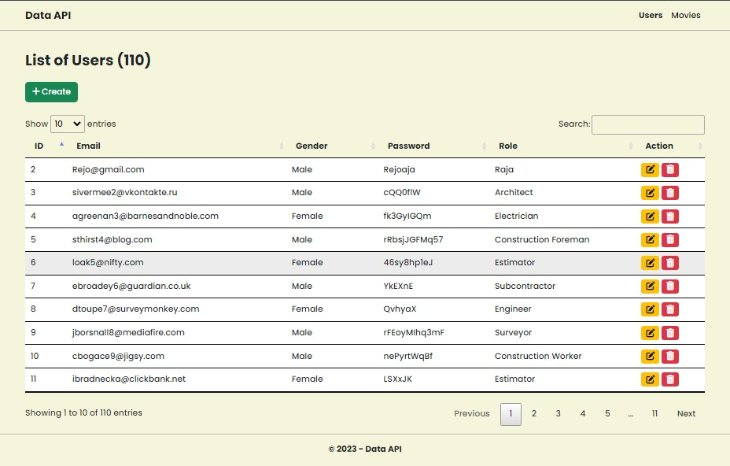
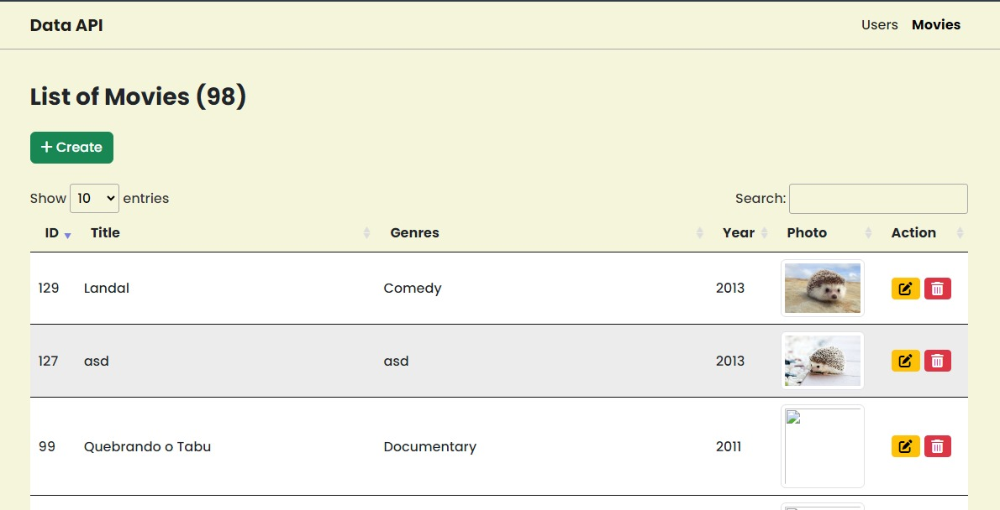
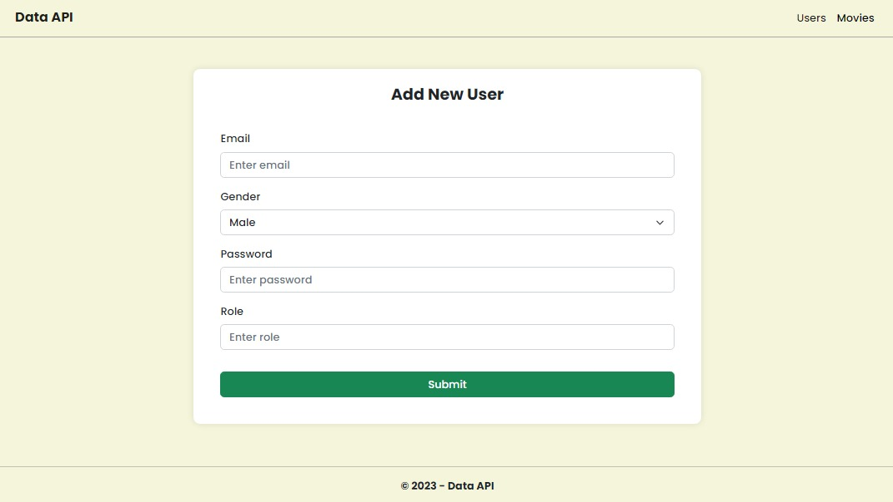
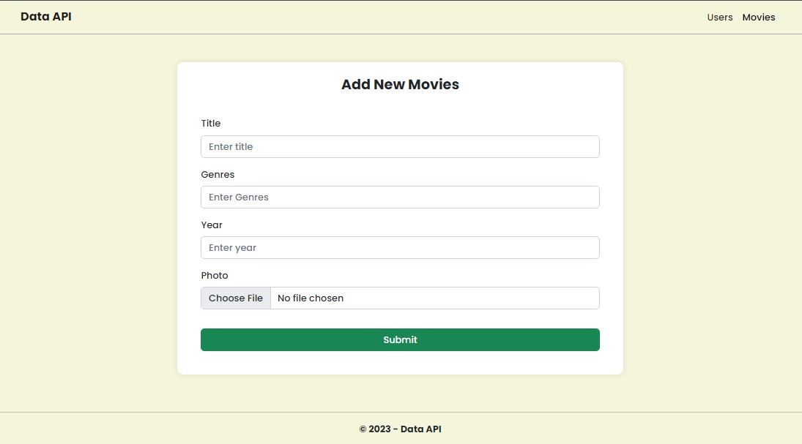
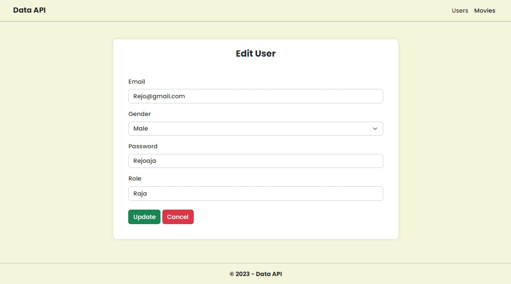
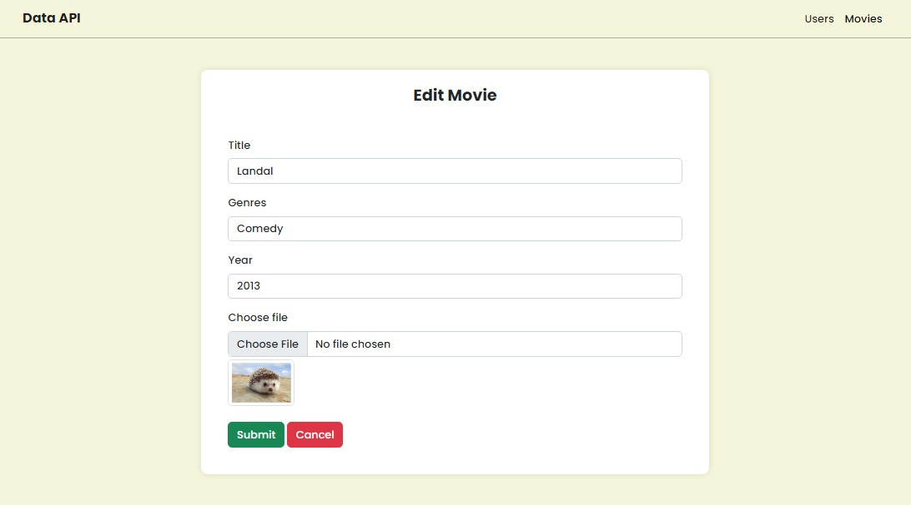
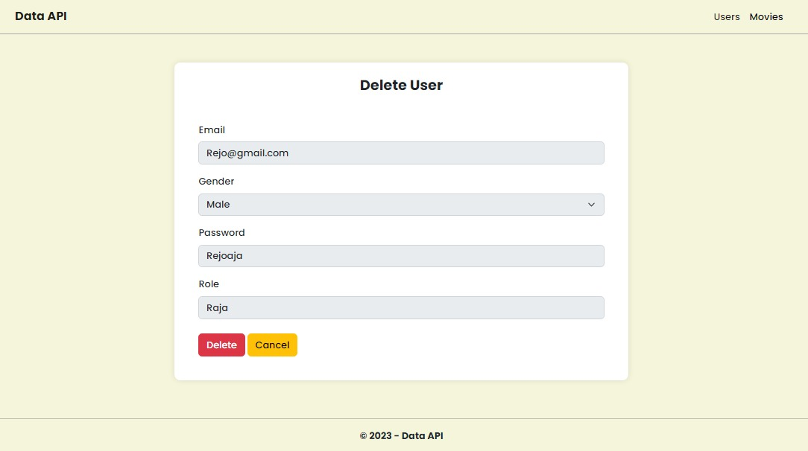
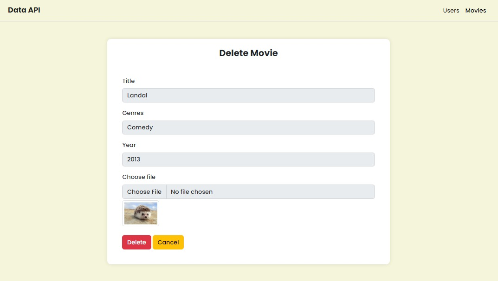
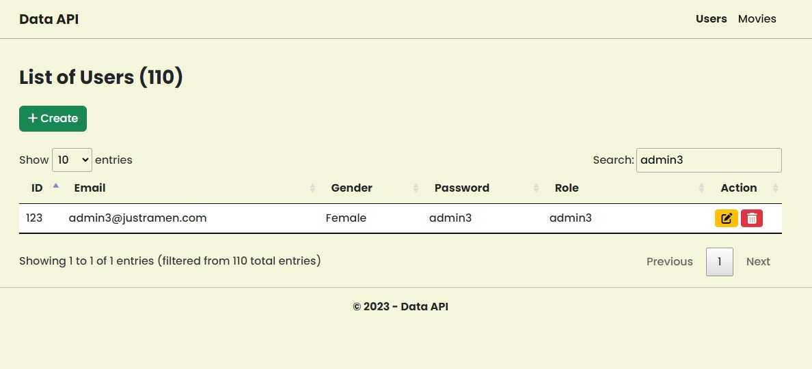
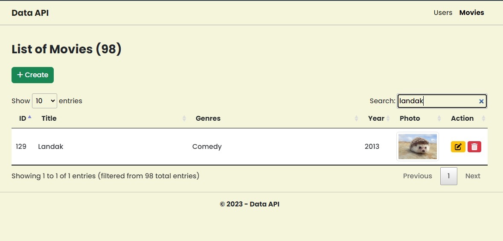

# ExpressJS-Week10

Nama : Rizki Rifani (FSWD 5A)

Program ini merupakan projek Restfull API yang terdiri dari GET, POST, DELETE, dan PUT. Pada program ini ada beberapa endpoint utama yang digunakan untuk menjalan program yaitu sebagai berikut:

Untuk akses Users data :
- All Data : `http://localhost:3000/users/all`
- Create Data : `http://localhost:3000/users/add`
- Delete Data : `http://localhost:3000/users/delete/:id`
- Update Data : `http://localhost:3000/users/edit/:id`

</br>

Untuk akses Movies data :
- All Data : `http://localhost:3000/movies/all`
- Create Data : `http://localhost:3000/movies/add`
- Delete Data : `http://localhost:3000/movies/delete/:id`
- Update Data : `http://localhost:3000/movies/edit/:id`

</br>
Pada program ini terdiri dari beberap folder dan file :
</br>

1.	src: Ini adalah folder utama yang berisi sebagian besar kode program
-	models: Folder yang berisi file userModel dan movieModel yang berhubungan langsung dengan basis data. Isi : userModel.js dan userModel.js
-	controllers: Folder yang berisi file untuk menangani logika bisnis, mengatur aliran permintaan HTTP, dan memanggil layanan. Isi : movieController.js dan userController.js
-	routes: Folder yang berisi file yang mendefinisikan rute atau endpoint HTTP dan mengarahkannya ke metode kontrol yang sesuai. Isi : userRoutes.js, movieRoutes.js, dan index.js
-	uploads: Folder yang berisi untuk menyimpan berkas yang diunggah.
-	db: folder berisi file untuk koneksi ke basis data. Isi : database.js
-	utils: folder ini berisi file utilitas atau fungsi bantuan yang digunakan di seluruh program. Isi : multer.js dan flash.js
-	repositories: Folder yang digunakan untuk mengisolasi akses langsung ke basis data dari controllers. Isi : userRepository.js dan movieRepository.js
-	views: Folder Ini adalah file untuk tampilan, seperti berkas EJS atau file HTML.
-	public: Folder ini berisi aset publik yang dapat diakses langsung, yang berisi file CSS, dan JavaScript.
2.	node_modules: Ini adalah Folder di mana semua modul Node.js eksternal diinstal.
3.	index.js: File adalah file utama dari program. Ini adalah file untuk menyiapkan server, mengonfigurasi middleware, dan mendefinisikan rute.


## Persyaratan

Sebelum dapat menjalankan aplikasi, pastikan telah memenuhi persyaratan berikut:

- Node.js
- PostgreSQL
- Browser
- Postman (optional)

## Instalasi

1. Clone repositori ini ke komputer:

   ```bash
   git clone https://github.com/rizkirifandi7/ExpressJS---Week10.git

2. Pindah ke direktori projek

   ```bash
   cd ExpressJS---Week10

3. Install package module

   ```bash
   npm install
   
4. Buatlah file baru dengan nama `.env` kemudian atur dan sesuaikan dengan program 

5. Import sample data `movies-database.sql` ke database PostgreSQL

6. Proses selesai


## Demo Program
1. Pastikan semua program sudah benar dan terhubung ke database, kemudian jalankan program dengan terminal menggunakan command berikut : 

   ```bash
   npm run start

2. Mulailah menggunakan endpoint untuk mendapatkan semua data User atau Movie:

     ```bash
   http://localhost:3000/users/all atau  http://localhost:3000/movies/all

  Maka akan muncul seperti berikut:

  
  
  </br>
  
  
  
     
3. Untuk pertama cobalah untuk melakukan create User atau Movie :

     ```bash
   http://localhost:3000/users/add/:id atau  http://localhost:3000/movies/add/:id

  Maka akan muncul seperti berikut:
  
  
  
  </br>
  
  
  

4. Kemudian cobalah melakukan update data user atau movie :

     ```bash
   http://localhost:3000/users/edit/:id atau  http://localhost:3000/movies/edit/:id

  Maka akan muncul seperti berikut:
  
  
  
  </br>
  
  

5. Kemudian cobalah delete data user atau movie :

     ```bash
   http://localhost:3000/users/delete/:id atau  http://localhost:3000/movies/delete/:id

  Maka akan muncul seperti berikut:
  
  
  
  </br>
  
  


6. Kemudian cobalah mencari data user atau movie :

     ```bash
   http://localhost:3000/users/all atau  http://localhost:3000/movies/all

  Maka akan muncul seperti berikut:
  
  
  
  </br>
  
  

